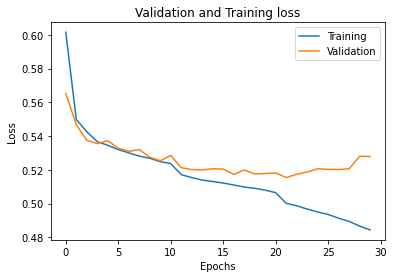
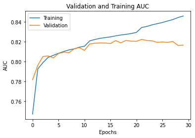
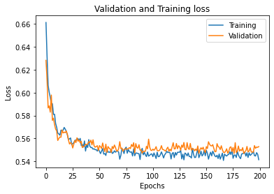
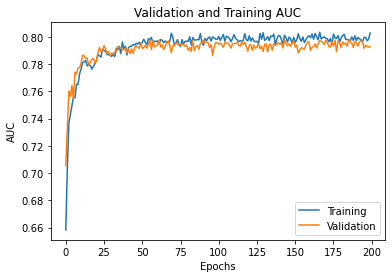
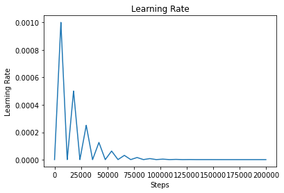
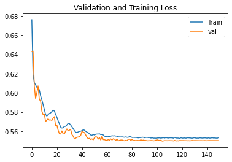
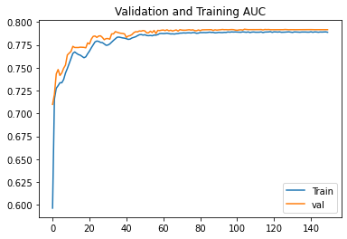
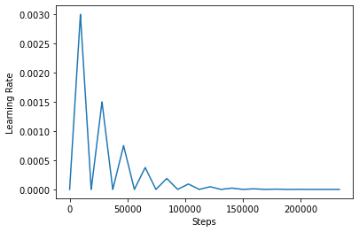

<h1 align=center> Exploring the underlying symmetries in particle physics with equivariant neural networks</h1>

## Common Task 1 (Electron/photon classification):
&emsp; **Binary classification** problem for **2 channel** images of Electron and Photons.

### Architecture:
&emsp; ResNet Architecture was implemented. The backbone of the network was made with ResNet50 architecture. Since the image was only 32X32, only 2 out of 5 blocks of the ResNet50 architecture were used.

### Optimiser:
&emsp; ADAM with Reduce Learning on Plateau. The model was made to train for 100 epochs. The checkpoints were collected from epoch no 22 since it had the highest Validation AUC.
### Result:
Validation **AUC: 0.8224**
| Loss | AUC |
| --- | --- |
|  |  |

## Common Task 2 (Deep Learning-based Quark-Gluon Classification):
&emsp; **Binary classification** problem for **3 channel** images of Quark and Gluons.

### Architecture:
&emsp; An efficient Architecture was used as the main backbone of the network followed by the Global Average Pooling layer and Fully Connected Layers along with Dropout layers.

### Optimiser:
&emsp; ADAM with a cyclic learning rate policy was used. The model was made to train for 200 epochs. The learning rate policy was triangular with decreasing max learning rate. The checkpoints were collected from epoch no 186 as it had the maximum validation AUC score of 0.7980.

### Result:
Validation **AUC: 0.7980**
| Loss | AUC | Learning Rate |
| --- | --- | --- |
|  |  |  |

## Equivariant Neural Networks:
&emsp; **Binary classification** problem for **3 channel** images of Quark and Gluons.

### Basic Intuition:
&emsp; The basic idea of using Equivariant Neural Network in the place of Non-Equivariant ones are to preserve the Equivariance of the data and build our models with the inductive bias that certain symmetries exists in our data. Conventional Convoltutional Neural Networks are Translation equivariant due to the sliding nature of the convolutional kernels. Often in many real life examples a number of symmetries exists in the data such as rotational, scaling, etc. To encode these type of equivariances in our model we use Equivariant Neural Networks. The principle of weight sharing across different axis of equivariance helps the model to generalize better than Vanilla Convolutional Neural Networks.

### Architecture:
&emsp; We train a number of Regular Group Convolutional Neural Networks (G-CNN) along with a traditional CNN to understand the nature and performance of the G-CNNs with respect to the CNNs. We build our Regular G-CNNs on the basis of these two groups:-
* Cyclic Groups (Cn): The group of all rotations generated by the generator of Cn
* Dihedral group (Dn): The group of symmetries of a regular polygon which includes rotation and reflections. 

We have trained the following models as a part of the evaluation test:-
* C4: A 19 layer deep network with C4 equivariance
* C8: A 19 layer deep network with C8 equivariance
* D4: A 19 layer deep network with D4 equivariance
* D8: A 19 layer deep network with D8 equivariance
* C4_lite: A lighter version(Parameters reduced) of the C4 network
* C8_lite: A lighter version(Parameters reduced) of the C8 network
* D4_lite: A lighter version(Parameters reduced) of the D4 network
* D8_lite: A lighter version(Parameters reduced) of the D8 network
* Non_Equivariant: A 19 layer deep network with similar architecture.

### Optimiser:
&emsp; ADAM with LR_Reduce_On_Plateau policy was used to train the networks with an initial learning rate of 1e-3.

### Result:
Validation **AUC: 0.7980**
| Loss | AUC | Learning Rate |
| --- | --- | --- |
|  |  |  |

## Discussions:
&emsp; Although the ViT architecture is the new State of the Art for image classification still we obtained a lesser AUC compared to the CNN. This is due to the fact that Visual Image Transformer was not pre-trained and the dataset was not sufficient to get State of the Art results form the ViT.
